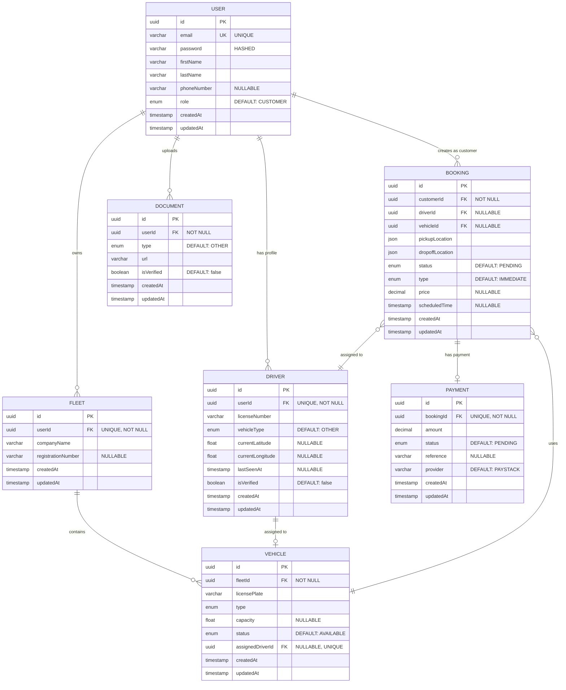

# Truckly Database Schema

## Overview

This document describes the complete database schema for the Truckly freight logistics platform. The database uses **PostgreSQL** with **TypeORM** as the ORM.

---

## Database Information

- **Database Type**: PostgreSQL 16+
- **ORM**: TypeORM
- **Character Set**: UTF-8
- **Timezone**: UTC
- **Total Tables**: 7

---

## Entity Relationship Diagram



---

## Table Definitions

### 1. `user` Table

Stores all user accounts across different roles.

| Column | Type | Constraints | Description |
|--------|------|-------------|-------------|
| `id` | UUID | PRIMARY KEY | Auto-generated UUID |
| `email` | VARCHAR | UNIQUE, NOT NULL | User's email address |
| `password` | VARCHAR | NOT NULL | Bcrypt hashed password |
| `firstName` | VARCHAR | NOT NULL | User's first name |
| `lastName` | VARCHAR | NOT NULL | User's last name |
| `phoneNumber` | VARCHAR | NULLABLE | Phone number (Ghana format) |
| `role` | ENUM | NOT NULL, DEFAULT 'CUSTOMER' | User role |
| `createdAt` | TIMESTAMP | NOT NULL | Record creation timestamp |
| `updatedAt` | TIMESTAMP | NOT NULL | Last update timestamp |

**Enums:**
```sql
CREATE TYPE user_role AS ENUM (
    'ADMIN',
    'CUSTOMER',
    'DRIVER',
    'FLEET_OWNER'
);
```

**Indexes:**
```sql
CREATE UNIQUE INDEX idx_user_email ON "user"(email);
CREATE INDEX idx_user_role ON "user"(role);
```

**SQL Schema:**
```sql
CREATE TABLE "user" (
    id UUID PRIMARY KEY DEFAULT uuid_generate_v4(),
    email VARCHAR(255) UNIQUE NOT NULL,
    password VARCHAR(255) NOT NULL,
    "firstName" VARCHAR(100) NOT NULL,
    "lastName" VARCHAR(100) NOT NULL,
    "phoneNumber" VARCHAR(20),
    role user_role NOT NULL DEFAULT 'CUSTOMER',
    "createdAt" TIMESTAMP NOT NULL DEFAULT NOW(),
    "updatedAt" TIMESTAMP NOT NULL DEFAULT NOW()
);
```

---

### 2. `driver` Table

Stores driver-specific information and location data.

| Column | Type | Constraints | Description |
|--------|------|-------------|-------------|
| `id` | UUID | PRIMARY KEY | Auto-generated UUID |
| `userId` | UUID | FOREIGN KEY, UNIQUE, NOT NULL | References `user.id` |
| `licenseNumber` | VARCHAR | NOT NULL | Driver's license number |
| `vehicleType` | ENUM | NOT NULL, DEFAULT 'OTHER' | Preferred vehicle type |
| `currentLatitude` | FLOAT | NULLABLE | Current GPS latitude |
| `currentLongitude` | FLOAT | NULLABLE | Current GPS longitude |
| `lastSeenAt` | TIMESTAMP | NULLABLE | Last location update time |
| `isVerified` | BOOLEAN | NOT NULL, DEFAULT false | Verification status |
| `createdAt` | TIMESTAMP | NOT NULL | Record creation timestamp |
| `updatedAt` | TIMESTAMP | NOT NULL | Last update timestamp |

**Enums:**
```sql
CREATE TYPE vehicle_type AS ENUM (
    'TRAILER',
    'TIPPER_TRUCK',
    'BUS',
    'MINING_TRANSPORT',
    'OTHER'
);
```

**Indexes:**
```sql
CREATE UNIQUE INDEX idx_driver_userId ON driver("userId");
CREATE INDEX idx_driver_isVerified ON driver("isVerified");
CREATE INDEX idx_driver_location ON driver("currentLatitude", "currentLongitude");
```

**SQL Schema:**
```sql
CREATE TABLE driver (
    id UUID PRIMARY KEY DEFAULT uuid_generate_v4(),
    "userId" UUID UNIQUE NOT NULL REFERENCES "user"(id) ON DELETE CASCADE,
    "licenseNumber" VARCHAR(100) NOT NULL,
    "vehicleType" vehicle_type NOT NULL DEFAULT 'OTHER',
    "currentLatitude" FLOAT,
    "currentLongitude" FLOAT,
    "lastSeenAt" TIMESTAMP,
    "isVerified" BOOLEAN NOT NULL DEFAULT false,
    "createdAt" TIMESTAMP NOT NULL DEFAULT NOW(),
    "updatedAt" TIMESTAMP NOT NULL DEFAULT NOW()
);
```

---

### 3. `fleet` Table

Stores fleet owner company information.

| Column | Type | Constraints | Description |
|--------|------|-------------|-------------|
| `id` | UUID | PRIMARY KEY | Auto-generated UUID |
| `userId` | UUID | FOREIGN KEY, UNIQUE, NOT NULL | References `user.id` |
| `companyName` | VARCHAR | NOT NULL | Company/fleet name |
| `registrationNumber` | VARCHAR | NULLABLE | Business registration number |
| `createdAt` | TIMESTAMP | NOT NULL | Record creation timestamp |
| `updatedAt` | TIMESTAMP | NOT NULL | Last update timestamp |

**Indexes:**
```sql
CREATE UNIQUE INDEX idx_fleet_userId ON fleet("userId");
CREATE INDEX idx_fleet_companyName ON fleet("companyName");
```

**SQL Schema:**
```sql
CREATE TABLE fleet (
    id UUID PRIMARY KEY DEFAULT uuid_generate_v4(),
    "userId" UUID UNIQUE NOT NULL REFERENCES "user"(id) ON DELETE CASCADE,
    "companyName" VARCHAR(255) NOT NULL,
    "registrationNumber" VARCHAR(100),
    "createdAt" TIMESTAMP NOT NULL DEFAULT NOW(),
    "updatedAt" TIMESTAMP NOT NULL DEFAULT NOW()
);
```

---

### 4. `vehicle` Table

Stores vehicle information belonging to fleets.

| Column | Type | Constraints | Description |
|--------|------|-------------|-------------|
| `id` | UUID | PRIMARY KEY | Auto-generated UUID |
| `fleetId` | UUID | FOREIGN KEY, NOT NULL | References `fleet.id` |
| `licensePlate` | VARCHAR | NOT NULL | Vehicle license plate |
| `type` | ENUM | NOT NULL | Vehicle type |
| `capacity` | FLOAT | NULLABLE | Capacity (tons/seats) |
| `status` | ENUM | NOT NULL, DEFAULT 'AVAILABLE' | Vehicle availability |
| `assignedDriverId` | UUID | FOREIGN KEY, NULLABLE, UNIQUE | References `driver.id` |
| `createdAt` | TIMESTAMP | NOT NULL | Record creation timestamp |
| `updatedAt` | TIMESTAMP | NOT NULL | Last update timestamp |

**Enums:**
```sql
CREATE TYPE vehicle_status AS ENUM (
    'AVAILABLE',
    'IN_USE',
    'MAINTENANCE'
);
```

**Indexes:**
```sql
CREATE INDEX idx_vehicle_fleetId ON vehicle("fleetId");
CREATE INDEX idx_vehicle_status ON vehicle(status);
CREATE UNIQUE INDEX idx_vehicle_assignedDriverId ON vehicle("assignedDriverId") WHERE "assignedDriverId" IS NOT NULL;
CREATE INDEX idx_vehicle_licensePlate ON vehicle("licensePlate");
```

**SQL Schema:**
```sql
CREATE TABLE vehicle (
    id UUID PRIMARY KEY DEFAULT uuid_generate_v4(),
    "fleetId" UUID NOT NULL REFERENCES fleet(id) ON DELETE CASCADE,
    "licensePlate" VARCHAR(50) NOT NULL,
    type vehicle_type NOT NULL,
    capacity FLOAT,
    status vehicle_status NOT NULL DEFAULT 'AVAILABLE',
    "assignedDriverId" UUID UNIQUE REFERENCES driver(id) ON DELETE SET NULL,
    "createdAt" TIMESTAMP NOT NULL DEFAULT NOW(),
    "updatedAt" TIMESTAMP NOT NULL DEFAULT NOW()
);
```

---

### 5. `booking` Table

Stores customer booking/trip requests.

| Column | Type | Constraints | Description |
|--------|------|-------------|-------------|
| `id` | UUID | PRIMARY KEY | Auto-generated UUID |
| `customerId` | UUID | FOREIGN KEY, NOT NULL | References `user.id` |
| `driverId` | UUID | FOREIGN KEY, NULLABLE | References `driver.id` |
| `vehicleId` | UUID | FOREIGN KEY, NULLABLE | References `vehicle.id` |
| `pickupLocation` | JSON | NOT NULL | `{lat, lng, address}` |
| `dropoffLocation` | JSON | NOT NULL | `{lat, lng, address}` |
| `status` | ENUM | NOT NULL, DEFAULT 'PENDING' | Booking status |
| `type` | ENUM | NOT NULL, DEFAULT 'IMMEDIATE' | Booking type |
| `price` | DECIMAL(10,2) | NULLABLE | Trip price |
| `scheduledTime` | TIMESTAMP | NULLABLE | Scheduled pickup time |
| `createdAt` | TIMESTAMP | NOT NULL | Record creation timestamp |
| `updatedAt` | TIMESTAMP | NOT NULL | Last update timestamp |

**Enums:**
```sql
CREATE TYPE booking_status AS ENUM (
    'PENDING',
    'ACCEPTED',
    'IN_PROGRESS',
    'COMPLETED',
    'CANCELLED'
);

CREATE TYPE booking_type AS ENUM (
    'IMMEDIATE',
    'SCHEDULED',
    'LONG_TERM'
);
```

**Indexes:**
```sql
CREATE INDEX idx_booking_customerId ON booking("customerId");
CREATE INDEX idx_booking_driverId ON booking("driverId");
CREATE INDEX idx_booking_vehicleId ON booking("vehicleId");
CREATE INDEX idx_booking_status ON booking(status);
CREATE INDEX idx_booking_createdAt ON booking("createdAt" DESC);
```

**SQL Schema:**
```sql
CREATE TABLE booking (
    id UUID PRIMARY KEY DEFAULT uuid_generate_v4(),
    "customerId" UUID NOT NULL REFERENCES "user"(id) ON DELETE CASCADE,
    "driverId" UUID REFERENCES driver(id) ON DELETE SET NULL,
    "vehicleId" UUID REFERENCES vehicle(id) ON DELETE SET NULL,
    "pickupLocation" JSON NOT NULL,
    "dropoffLocation" JSON NOT NULL,
    status booking_status NOT NULL DEFAULT 'PENDING',
    type booking_type NOT NULL DEFAULT 'IMMEDIATE',
    price DECIMAL(10, 2),
    "scheduledTime" TIMESTAMP,
    "createdAt" TIMESTAMP NOT NULL DEFAULT NOW(),
    "updatedAt" TIMESTAMP NOT NULL DEFAULT NOW()
);
```

**JSON Structure:**
```json
{
  "pickupLocation": {
    "lat": 5.6037,
    "lng": -0.187,
    "address": "123 Main St, Accra, Ghana"
  },
  "dropoffLocation": {
    "lat": 5.6500,
    "lng": -0.200,
    "address": "456 Market Rd, Tema, Ghana"
  }
}
```

---

### 6. `payment` Table

Stores payment transactions for bookings.

| Column | Type | Constraints | Description |
|--------|------|-------------|-------------|
| `id` | UUID | PRIMARY KEY | Auto-generated UUID |
| `bookingId` | UUID | FOREIGN KEY, UNIQUE, NOT NULL | References `booking.id` |
| `amount` | DECIMAL(10,2) | NOT NULL | Payment amount |
| `status` | ENUM | NOT NULL, DEFAULT 'PENDING' | Payment status |
| `reference` | VARCHAR | NULLABLE | Payment gateway reference |
| `provider` | VARCHAR | NOT NULL, DEFAULT 'PAYSTACK' | Payment provider |
| `createdAt` | TIMESTAMP | NOT NULL | Record creation timestamp |
| `updatedAt` | TIMESTAMP | NOT NULL | Last update timestamp |

**Enums:**
```sql
CREATE TYPE payment_status AS ENUM (
    'PENDING',
    'SUCCESS',
    'FAILED'
);
```

**Indexes:**
```sql
CREATE UNIQUE INDEX idx_payment_bookingId ON payment("bookingId");
CREATE INDEX idx_payment_status ON payment(status);
CREATE INDEX idx_payment_reference ON payment(reference);
```

**SQL Schema:**
```sql
CREATE TABLE payment (
    id UUID PRIMARY KEY DEFAULT uuid_generate_v4(),
    "bookingId" UUID UNIQUE NOT NULL REFERENCES booking(id) ON DELETE CASCADE,
    amount DECIMAL(10, 2) NOT NULL,
    status payment_status NOT NULL DEFAULT 'PENDING',
    reference VARCHAR(255),
    provider VARCHAR(50) NOT NULL DEFAULT 'PAYSTACK',
    "createdAt" TIMESTAMP NOT NULL DEFAULT NOW(),
    "updatedAt" TIMESTAMP NOT NULL DEFAULT NOW()
);
```

---

### 7. `document` Table

Stores uploaded documents for verification.

| Column | Type | Constraints | Description |
|--------|------|-------------|-------------|
| `id` | UUID | PRIMARY KEY | Auto-generated UUID |
| `userId` | UUID | FOREIGN KEY, NOT NULL | References `user.id` |
| `type` | ENUM | NOT NULL, DEFAULT 'OTHER' | Document type |
| `url` | VARCHAR | NOT NULL | File storage URL/path |
| `isVerified` | BOOLEAN | NOT NULL, DEFAULT false | Verification status |
| `createdAt` | TIMESTAMP | NOT NULL | Record creation timestamp |
| `updatedAt` | TIMESTAMP | NOT NULL | Last update timestamp |

**Enums:**
```sql
CREATE TYPE document_type AS ENUM (
    'LICENSE',
    'INSURANCE',
    'ID_CARD',
    'OTHER'
);
```

**Indexes:**
```sql
CREATE INDEX idx_document_userId ON document("userId");
CREATE INDEX idx_document_type ON document(type);
CREATE INDEX idx_document_isVerified ON document("isVerified");
```

**SQL Schema:**
```sql
CREATE TABLE document (
    id UUID PRIMARY KEY DEFAULT uuid_generate_v4(),
    "userId" UUID NOT NULL REFERENCES "user"(id) ON DELETE CASCADE,
    type document_type NOT NULL DEFAULT 'OTHER',
    url VARCHAR(500) NOT NULL,
    "isVerified" BOOLEAN NOT NULL DEFAULT false,
    "createdAt" TIMESTAMP NOT NULL DEFAULT NOW(),
    "updatedAt" TIMESTAMP NOT NULL DEFAULT NOW()
);
```

---

## Relationships Summary

### One-to-One Relationships
1. **User → Driver**: One user can have one driver profile
2. **User → Fleet**: One user can own one fleet
3. **Driver → Vehicle**: One driver can be assigned to one vehicle
4. **Booking → Payment**: One booking has one payment

### One-to-Many Relationships
1. **User → Bookings**: One customer can create many bookings
2. **User → Documents**: One user can upload many documents
3. **Fleet → Vehicles**: One fleet can have many vehicles
4. **Driver → Bookings**: One driver can have many bookings
5. **Vehicle → Bookings**: One vehicle can be used in many bookings

---

## Complete Database Initialization Script

```sql
-- Enable UUID extension
CREATE EXTENSION IF NOT EXISTS "uuid-ossp";

-- Create ENUM types
CREATE TYPE user_role AS ENUM ('ADMIN', 'CUSTOMER', 'DRIVER', 'FLEET_OWNER');
CREATE TYPE vehicle_type AS ENUM ('TRAILER', 'TIPPER_TRUCK', 'BUS', 'MINING_TRANSPORT', 'OTHER');
CREATE TYPE vehicle_status AS ENUM ('AVAILABLE', 'IN_USE', 'MAINTENANCE');
CREATE TYPE booking_status AS ENUM ('PENDING', 'ACCEPTED', 'IN_PROGRESS', 'COMPLETED', 'CANCELLED');
CREATE TYPE booking_type AS ENUM ('IMMEDIATE', 'SCHEDULED', 'LONG_TERM');
CREATE TYPE payment_status AS ENUM ('PENDING', 'SUCCESS', 'FAILED');
CREATE TYPE document_type AS ENUM ('LICENSE', 'INSURANCE', 'ID_CARD', 'OTHER');

-- Create tables
CREATE TABLE "user" (
    id UUID PRIMARY KEY DEFAULT uuid_generate_v4(),
    email VARCHAR(255) UNIQUE NOT NULL,
    password VARCHAR(255) NOT NULL,
    "firstName" VARCHAR(100) NOT NULL,
    "lastName" VARCHAR(100) NOT NULL,
    "phoneNumber" VARCHAR(20),
    role user_role NOT NULL DEFAULT 'CUSTOMER',
    "createdAt" TIMESTAMP NOT NULL DEFAULT NOW(),
    "updatedAt" TIMESTAMP NOT NULL DEFAULT NOW()
);

CREATE TABLE driver (
    id UUID PRIMARY KEY DEFAULT uuid_generate_v4(),
    "userId" UUID UNIQUE NOT NULL REFERENCES "user"(id) ON DELETE CASCADE,
    "licenseNumber" VARCHAR(100) NOT NULL,
    "vehicleType" vehicle_type NOT NULL DEFAULT 'OTHER',
    "currentLatitude" FLOAT,
    "currentLongitude" FLOAT,
    "lastSeenAt" TIMESTAMP,
    "isVerified" BOOLEAN NOT NULL DEFAULT false,
    "createdAt" TIMESTAMP NOT NULL DEFAULT NOW(),
    "updatedAt" TIMESTAMP NOT NULL DEFAULT NOW()
);

CREATE TABLE fleet (
    id UUID PRIMARY KEY DEFAULT uuid_generate_v4(),
    "userId" UUID UNIQUE NOT NULL REFERENCES "user"(id) ON DELETE CASCADE,
    "companyName" VARCHAR(255) NOT NULL,
    "registrationNumber" VARCHAR(100),
    "createdAt" TIMESTAMP NOT NULL DEFAULT NOW(),
    "updatedAt" TIMESTAMP NOT NULL DEFAULT NOW()
);

CREATE TABLE vehicle (
    id UUID PRIMARY KEY DEFAULT uuid_generate_v4(),
    "fleetId" UUID NOT NULL REFERENCES fleet(id) ON DELETE CASCADE,
    "licensePlate" VARCHAR(50) NOT NULL,
    type vehicle_type NOT NULL,
    capacity FLOAT,
    status vehicle_status NOT NULL DEFAULT 'AVAILABLE',
    "assignedDriverId" UUID UNIQUE REFERENCES driver(id) ON DELETE SET NULL,
    "createdAt" TIMESTAMP NOT NULL DEFAULT NOW(),
    "updatedAt" TIMESTAMP NOT NULL DEFAULT NOW()
);

CREATE TABLE booking (
    id UUID PRIMARY KEY DEFAULT uuid_generate_v4(),
    "customerId" UUID NOT NULL REFERENCES "user"(id) ON DELETE CASCADE,
    "driverId" UUID REFERENCES driver(id) ON DELETE SET NULL,
    "vehicleId" UUID REFERENCES vehicle(id) ON DELETE SET NULL,
    "pickupLocation" JSON NOT NULL,
    "dropoffLocation" JSON NOT NULL,
    status booking_status NOT NULL DEFAULT 'PENDING',
    type booking_type NOT NULL DEFAULT 'IMMEDIATE',
    price DECIMAL(10, 2),
    "scheduledTime" TIMESTAMP,
    "createdAt" TIMESTAMP NOT NULL DEFAULT NOW(),
    "updatedAt" TIMESTAMP NOT NULL DEFAULT NOW()
);

CREATE TABLE payment (
    id UUID PRIMARY KEY DEFAULT uuid_generate_v4(),
    "bookingId" UUID UNIQUE NOT NULL REFERENCES booking(id) ON DELETE CASCADE,
    amount DECIMAL(10, 2) NOT NULL,
    status payment_status NOT NULL DEFAULT 'PENDING',
    reference VARCHAR(255),
    provider VARCHAR(50) NOT NULL DEFAULT 'PAYSTACK',
    "createdAt" TIMESTAMP NOT NULL DEFAULT NOW(),
    "updatedAt" TIMESTAMP NOT NULL DEFAULT NOW()
);

CREATE TABLE document (
    id UUID PRIMARY KEY DEFAULT uuid_generate_v4(),
    "userId" UUID NOT NULL REFERENCES "user"(id) ON DELETE CASCADE,
    type document_type NOT NULL DEFAULT 'OTHER',
    url VARCHAR(500) NOT NULL,
    "isVerified" BOOLEAN NOT NULL DEFAULT false,
    "createdAt" TIMESTAMP NOT NULL DEFAULT NOW(),
    "updatedAt" TIMESTAMP NOT NULL DEFAULT NOW()
);

-- Create indexes
CREATE UNIQUE INDEX idx_user_email ON "user"(email);
CREATE INDEX idx_user_role ON "user"(role);

CREATE UNIQUE INDEX idx_driver_userId ON driver("userId");
CREATE INDEX idx_driver_isVerified ON driver("isVerified");
CREATE INDEX idx_driver_location ON driver("currentLatitude", "currentLongitude");

CREATE UNIQUE INDEX idx_fleet_userId ON fleet("userId");
CREATE INDEX idx_fleet_companyName ON fleet("companyName");

CREATE INDEX idx_vehicle_fleetId ON vehicle("fleetId");
CREATE INDEX idx_vehicle_status ON vehicle(status);
CREATE INDEX idx_vehicle_licensePlate ON vehicle("licensePlate");

CREATE INDEX idx_booking_customerId ON booking("customerId");
CREATE INDEX idx_booking_driverId ON booking("driverId");
CREATE INDEX idx_booking_vehicleId ON booking("vehicleId");
CREATE INDEX idx_booking_status ON booking(status);
CREATE INDEX idx_booking_createdAt ON booking("createdAt" DESC);

CREATE UNIQUE INDEX idx_payment_bookingId ON payment("bookingId");
CREATE INDEX idx_payment_status ON payment(status);
CREATE INDEX idx_payment_reference ON payment(reference);

CREATE INDEX idx_document_userId ON document("userId");
CREATE INDEX idx_document_type ON document(type);
CREATE INDEX idx_document_isVerified ON document("isVerified");
```

---

## Common Queries

### Find nearby drivers
```sql
-- Note: For production, use Redis GEOSEARCH for better performance
SELECT 
    d.id,
    d."userId",
    d."currentLatitude",
    d."currentLongitude",
    u."firstName",
    u."lastName",
    u."phoneNumber",
    -- Calculate distance using Haversine formula
    (
        6371 * acos(
            cos(radians(5.6037)) * 
            cos(radians(d."currentLatitude")) * 
            cos(radians(d."currentLongitude") - radians(-0.187)) + 
            sin(radians(5.6037)) * 
            sin(radians(d."currentLatitude"))
        )
    ) AS distance_km
FROM driver d
JOIN "user" u ON d."userId" = u.id
WHERE 
    d."isVerified" = true
    AND d."currentLatitude" IS NOT NULL
    AND d."currentLongitude" IS NOT NULL
HAVING distance_km <= 10
ORDER BY distance_km ASC
LIMIT 5;
```

### Get booking with all details
```sql
SELECT 
    b.*,
    c."firstName" AS customer_first_name,
    c."lastName" AS customer_last_name,
    c.email AS customer_email,
    d."licenseNumber" AS driver_license,
    du."firstName" AS driver_first_name,
    du."lastName" AS driver_last_name,
    v."licensePlate" AS vehicle_plate,
    v.type AS vehicle_type,
    p.status AS payment_status,
    p.reference AS payment_reference
FROM booking b
JOIN "user" c ON b."customerId" = c.id
LEFT JOIN driver d ON b."driverId" = d.id
LEFT JOIN "user" du ON d."userId" = du.id
LEFT JOIN vehicle v ON b."vehicleId" = v.id
LEFT JOIN payment p ON b.id = p."bookingId"
WHERE b.id = 'booking-uuid-here';
```

### Get fleet with vehicles and drivers
```sql
SELECT 
    f.*,
    u."firstName" AS owner_first_name,
    u."lastName" AS owner_last_name,
    json_agg(
        json_build_object(
            'id', v.id,
            'licensePlate', v."licensePlate",
            'type', v.type,
            'status', v.status,
            'driver', json_build_object(
                'id', d.id,
                'name', du."firstName" || ' ' || du."lastName",
                'licenseNumber', d."licenseNumber"
            )
        )
    ) AS vehicles
FROM fleet f
JOIN "user" u ON f."userId" = u.id
LEFT JOIN vehicle v ON f.id = v."fleetId"
LEFT JOIN driver d ON v."assignedDriverId" = d.id
LEFT JOIN "user" du ON d."userId" = du.id
WHERE f.id = 'fleet-uuid-here'
GROUP BY f.id, u."firstName", u."lastName";
```

---

## Data Migration Notes

### TypeORM Synchronization
The application uses `synchronize: true` in development, which auto-creates tables. For production:

```typescript
// app.module.ts
TypeOrmModule.forRoot({
  // ...
  synchronize: false, // NEVER use true in production
  migrations: ['dist/migrations/*.js'],
  migrationsRun: true,
})
```

### Creating Migrations
```bash
# Generate migration from entity changes
npm run typeorm migration:generate -- -n MigrationName

# Run migrations
npm run typeorm migration:run

# Revert last migration
npm run typeorm migration:revert
```

---

## Backup & Restore

### Backup
```bash
# Full database backup
pg_dump -U postgres -d truckly -F c -b -v -f truckly_backup_$(date +%Y%m%d).dump

# Schema only
pg_dump -U postgres -d truckly -s -f truckly_schema.sql

# Data only
pg_dump -U postgres -d truckly -a -f truckly_data.sql
```

### Restore
```bash
# Restore from custom format
pg_restore -U postgres -d truckly -v truckly_backup.dump

# Restore from SQL
psql -U postgres -d truckly -f truckly_backup.sql
```

---

## Performance Optimization

### Recommended Indexes (Already Created)
- ✅ Unique indexes on foreign keys
- ✅ Indexes on frequently queried columns (email, status, role)
- ✅ Composite index on driver location
- ✅ Index on booking creation date for sorting

### Additional Optimizations
1. **Connection Pooling**: Configure in TypeORM
   ```typescript
   extra: {
     max: 20,
     min: 5,
     idleTimeoutMillis: 30000,
   }
   ```

2. **Query Optimization**: Use `select` to limit returned fields
3. **Pagination**: Always paginate large result sets
4. **Redis Caching**: Cache frequently accessed data

---

## Security Considerations

1. **Password Storage**: Always use bcrypt with salt rounds ≥ 10
2. **SQL Injection**: TypeORM parameterizes queries automatically
3. **Sensitive Data**: Password field has `select: false` by default
4. **Cascade Deletes**: Configured to maintain referential integrity
5. **UUID Primary Keys**: Prevents enumeration attacks

---

## Monitoring Queries

### Table sizes
```sql
SELECT 
    schemaname,
    tablename,
    pg_size_pretty(pg_total_relation_size(schemaname||'.'||tablename)) AS size
FROM pg_tables
WHERE schemaname = 'public'
ORDER BY pg_total_relation_size(schemaname||'.'||tablename) DESC;
```

### Active connections
```sql
SELECT count(*) FROM pg_stat_activity WHERE datname = 'truckly';
```

### Slow queries
```sql
SELECT 
    query,
    calls,
    total_time,
    mean_time,
    max_time
FROM pg_stat_statements
ORDER BY mean_time DESC
LIMIT 10;
```
